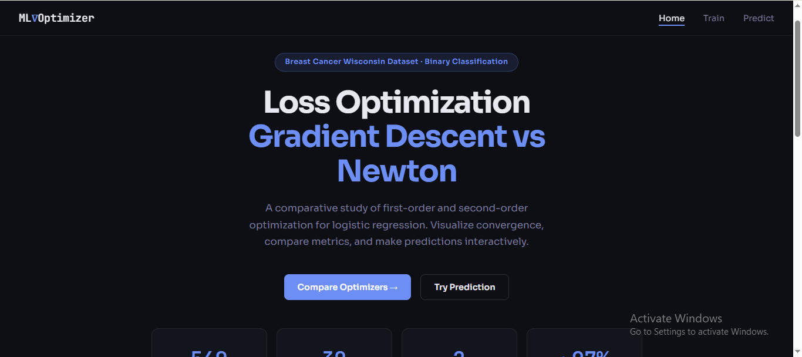
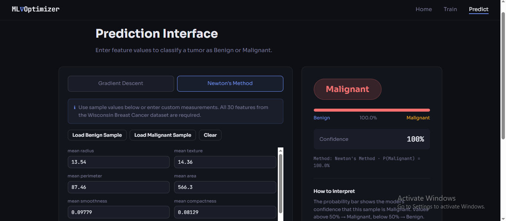

# 🧠 Machine Learning Loss Optimization

A visually interactive project which is comparing:

- Gradient Descent (1st Order)
- Newton's Method (2nd Order)

for Logistic Regression optimization.

[](https://ml-loss-optimization-app.onrender.com) 👈 Click Here!

---

## 🚀 Features

- Live loss convergence graph
- Fast Newton optimization
- Breast Cancer dataset (Scikit-learn)
- Prediction UI with probability

---

## 📸 Project Preview

### 🏠 Home Page


### 📊 Training Visualization
.png)

### 🔲 Confusion Matrix Comparison
.png)

### 🔮 Prediction Page


---

## 🛠 Tech Stack

- Python (Flask)
- NumPy
- Scikit-learn
- HTML, CSS, JavaScript
- Chart.js

---

## 📈 What This Project Shows

- How ML models reduce error (loss)
- Why Newton’s Method converges faster
- Real-world classification (Benign vs Malignant)

---

## ▶️ Run Locally

```bash
python -m venv venv
venv\Scripts\activate

pip install -r requirements.txt

python app.py
